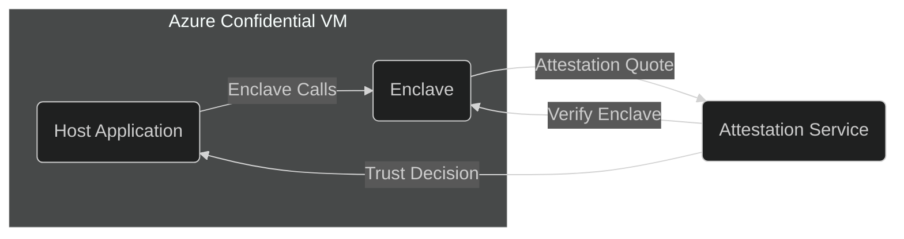

## Introduction

With partnership funding from Microsoft, I created a proof of concept for a major client to design, develop and implement an **Intel SGX (Software Guard Extensions)** solution in an **Azure Confidential Computing** environment. This practical engagement demonstrated the substantial enhancement of data-in-use protection afforded by a **Trusted Execution Environment (TEE)**, even within a cloud environment managed by third-party operators.

A cornerstone of this solution involved **attestation**, which provides cryptographic proof that an enclave is genuine and operates on genuine SGX hardware. By integrating attestation into the application, our client could confidently entrust sensitive data and keys to the enclave, knowing it was running in a verified secure environment.

**Azure Confidential Computing** leverages Intel SGX to provide secure enclaves within Confidential VMs. Comparable services exist in other major cloud providers—such as **[AWS Nitro Enclaves](https://aws.amazon.com/ec2/nitro/nitro-enclaves/)** or **[Google Cloud’s Confidential Computing](https://cloud.google.com/security/products/confidential-computing)**—all of which aim to ensure code and data remain secure during processing. By adopting enclaves and attestation, organizations can achieve strong privacy controls, regulatory compliance, and a foundation of trust across multi-tenant environments.

## Steps to Create an Enclave-Aware Application and VM

1. **Set Up a Builder Environment**
Prepare a dedicated environment (local or VM) with the necessary SDKs and libraries to build an SGX-compatible application.

2. **Containerize Your Build**
Use a Docker container configured with the OpenEnclave SDK or other required tools for consistent, reproducible builds.

3. **Provision an Azure Confidential VM**
Select a specialized SKU (e.g., DC-series) that supports Intel SGX, then deploy your VM in a region where confidential computing is available.

4. **Install SGX and TEE Components**
Load the Intel SGX drivers and the OpenEnclave SDK on your VM so the system can recognize and utilize enclave features.

5. **Compile and Sign Your Application**
Build the enclave (trusted code) separately from the host application (untrusted code), and sign the enclave to ensure integrity.

6. **Deploy and Verify**
Transfer the host application and the signed enclave onto the Azure Confidential VM, launch them, and confirm that enclave-based operations are functioning correctly.

## Architecture Overview

- **Host Application**

The untrusted process that handles tasks like file I/O, networking, and user interaction. It creates and manages enclaves but remains outside the protected execution domain.

- **Enclave**

A secure region of memory, protected by SGX hardware, where critical logic (e.g., cryptographic operations) and sensitive data reside. The enclave enforces strict isolation from the host operating system.

- **Attestation**

A mechanism to prove that the enclave is authentic and running on genuine SGX hardware. Attestation builds trust with external services or remote clients, enabling them to safely share secrets with the enclave.

## Testing and Quality Assurance

1. **Functional Testing**
Ensure that core operations (e.g., encryption, decryption, data manipulation) behave correctly under expected usage scenarios.

2. **Performance Testing**
Measure any impact of enclave boundary crossings and assess overall throughput, especially when handling large workloads or frequent enclave calls.

3. **Security Validation**
Verify that sensitive data is cleared from memory once it leaves the enclave. Confirm that vulnerabilities--such as buffer overflows--are mitigated through enclave boundary checks.

4. **Integration & Attestation Testing**
If the application communicates with external services, ensure that the attestation process works reliably. Validate that only attested enclaves receive protected data.

## Conclusion

Our successful client engagement with Microsoft exemplifies how **Intel SGX**—backed by **Azure Confidential Computing**—can deliver highly secure operations in the public cloud. By offloading sensitive logic to a **TEE** and incorporating **attestation**, organizations can confidently protect data-in-use and maintain compliance with strict privacy or regulatory requirements. Drawing on hands-on expertise, my company offers end-to-end support for deploying these enclave-based solutions, helping clients transform security postures and realize the benefits of confidential computing.

### Image Credit

Photo by <a href="https://unsplash.com/@randomthinking?utm_content=creditCopyText&utm_medium=referral&utm_source=unsplash">Random Thinking</a> on <a href="https://unsplash.com/photos/a-close-up-of-a-computer-motherboard-with-pink-lights-fX4lA-CIAwk?utm_content=creditCopyText&utm_medium=referral&utm_source=unsplash">Unsplash</a>

### References

[Trusted Execution Environments (TEE)](https://docs.trustauthority.intel.com/main/articles/concept-tees-overview.html)
