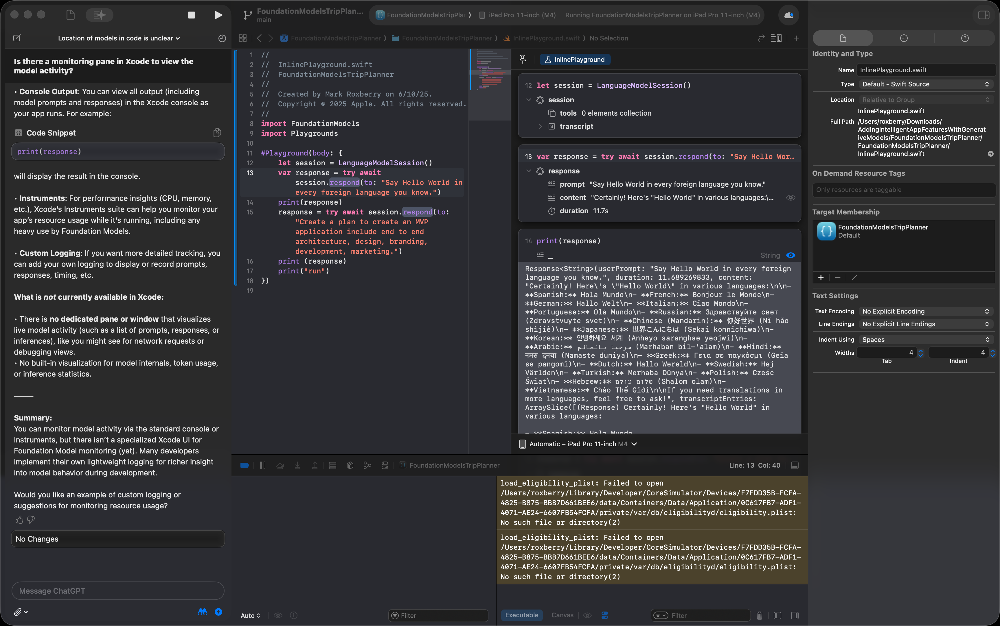

## Foundation Models: Apple’s Silent Revolution in On-Device Intelligence

While headlines have focused on delays in Siri's evolution, something much more significant was quietly unveiled at WWDC25: the beta release of **Foundation Models**, Apple’s new API for integrating on-device generative intelligence. This developer-facing capability enables the integration of large language models (LLMs) directly into iOS and macOS applications—with no cloud round-trips required.

This is what I consider the next major shift in generative AI: not just centralized models behind API gateways, but distributed, context-aware intelligence embedded into the devices we use every day. I call it the **proliferation of LLM technology**—from cloud to phone to IoT and System-on-Chip (SoC) hardware.

This post explores what Apple’s Foundation Models mean for developers, what I’m experimenting with next, and why I think this is bigger than Siri.

---

## What Are Foundation Models?

Apple describes Foundation Models as a developer API for integrating **on-device machine learning models** that support natural language interaction, text summarization, code generation, and more. These models are designed to work **offline**, with **privacy-preserving inference**, enabling use cases that once required calling cloud-based services like OpenAI or Anthropic.

Developers now have access to:

- Text-based generation and transformation  
- Built-in safety mechanisms  
- Optimized performance for Apple silicon  
- Model customization via system prompts and context  

This represents a major architectural shift for Apple platforms: moving from task-based ML (like image classification or OCR) to **general-purpose language reasoning directly on device**.

---

## From Skynet to iPhone: LLMs at the Edge

We’re entering a new phase in the generative AI lifecycle. The early days of GPT and Claude offered access to powerful but centralized models. Now, we’re seeing the **LLM stack push outward**:

- **Cloud**: API-hosted models (OpenAI, Azure, Claude)  
- **Device**: Local models running on phones, tablets, laptops  
- **IoT/SoC**: Lightweight models for microcontrollers, edge compute, embedded automation  

Apple’s Foundation Models are a textbook example of this trend—putting advanced reasoning and generation tools into the hands of developers building **everyday apps**, not just AI research labs.

The implications are profound:  
- AI-enabled personal apps that run offline  
- Context-aware intelligence tied to user data without exposing it to the cloud  
- Enhanced accessibility and autonomy in app behavior  

---

## Developer Guardrails and Design Questions

I’m currently exploring Apple’s safety and isolation strategies.

### Guardrails

How are generation limits, toxicity filters, and alignment prompts implemented on device? Will developers be able to audit, customize, or override them?

### Network Isolation

How “offline” is offline? Can models be sandboxed from network access to prevent exfiltration or misuse in sensitive applications?

### App Integration

How tightly can Foundation Models be woven into app experiences? Will Apple allow persistent memory, shared embeddings, or advanced chaining similar to agent frameworks?

These are the kinds of questions that will define how serious Apple is about putting real intelligence—safely—into the hands of developers and users.

---

## Future Plans and Experiments

Here’s what I’m exploring next:

- **SwiftUI Integrations**: Wrapping Foundation Models into natural, Swift-native UI components  
- **Local Prompt Chaining**: Simulating small agentic workflows without a backend  
- **Developer IDE Tools**: Using on-device LLMs to assist in coding, testing, or documentation directly within Xcode or a local dev tool  
- **IoT + SoC Extensions**: Conceptual designs for lightweight edge inference on constrained hardware, informed by Apple’s approach  

### Example: FoundationModels in Xcode Playground



Below is a simple `Playgrounds` example using the new Foundation Models API:

```swift
import FoundationModels
import Playgrounds

#Playground(body: {
    let session = LanguageModelSession()
    var response = try await session.respond(to: "Say Hello World in every foreign language you know.")
    print(response)
    response = try await session.respond(to: "Create a plan to create an MVP application include end to end architecture, design, branding, development, marketing.")
    print (response)
    print("run")
})
```

This shows just how lightweight and developer-friendly on-device LLMs can be—perfect for building and testing locally before ever touching a network call.

---

## References

- [Apple Intelligence – What’s New](https://developer.apple.com/apple-intelligence/whats-new/)
- [Foundation Models Documentation](https://developer.apple.com/documentation/foundationmodels)
- [Code Samples: Adding Intelligent App Features with Generative Models](https://developer.apple.com/documentation/foundationmodels/adding-intelligent-app-features-with-generative-models)
- [WWDC25 Announcement and Track](https://developer.apple.com/news/?id=892rul8r)

---

## Closing Thoughts

Apple’s Foundation Models may not grab headlines like a Siri redesign—but they’re far more important for developers. This is the start of an era where intelligent software runs not just **for** the user, but **with** the user—on their own hardware, on their own terms.

We’re watching generative intelligence go local. That’s bigger than Siri.

---

### Disclaimer

This post is based on a **beta release** of Foundation Models from Apple announced at WWDC25. Features, APIs, and performance may change before public release.
