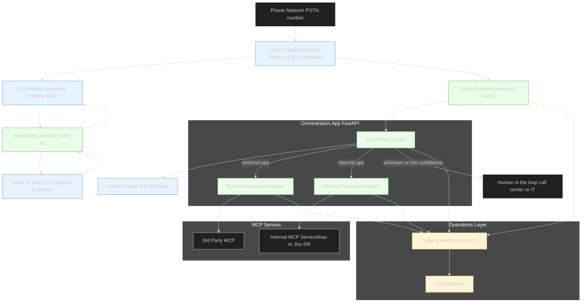
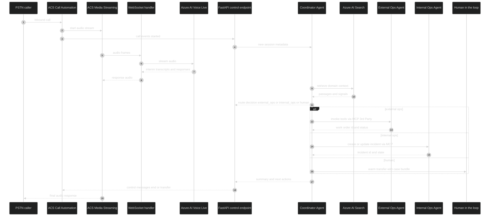

## Prototyping Voice Orchestration

I’ve started an early prototype to explore **AI-driven orchestration of live voice interactions**. The vision is a voice front door that listens, classifies, and routes requests automatically, while handing off smoothly to humans when needed.  

Unlike a single monolithic agent, this architecture separates the telephony, orchestration, and AI speech layers.

### The Architecture in Layers

- **Phone Network + ACS Front End**  
  Calls enter through a PSTN number anchored in **Azure Communication Services (ACS)**.  
    - *Call Automation* handles signaling and events.  
    - *Media Streaming* streams audio via WebSockets for real-time processing.  

- **Orchestration App (FastAPI)**  
  A Python FastAPI application running in Azure Container Apps.  
    - Hosts the **Coordinator Agent** (classifies intent with a RAG query to Azure AI Search).  
    - Runs the **External Operations Agent** (integrated with 3rd Party MCP) and the **Internal Operations** (integrated with Internal Operations MCP).  
    - Applies policies and routes each call domain appropriately.  
    - Handles human-in-the-loop escalation when confidence is low or policy requires it.  

- **Azure OpenAI Voice Live**  
  Provides ultra-low-latency **speech-to-speech AI**.  
    - Can be configured in *Agent Mode* (agent defined in Azure AI Studio).  
    - Or can act as a **speech front end**, invoked by the Orchestration App as one of its services (agent-to-agent).  
    - Converts caller audio to text, runs reasoning, and streams back voice responses.  

- **MCP Servers**  
  Each domain agent accesses external systems through **Model Context Protocol servers**.  
    - External Ops → 3rd Party Platform Support MCP (work orders, assets).  
    - Internal Ops → Internal Operations MCP (ServiceNow, Jira SM).  
    - MCPs isolate secrets and standardize tool contracts.  

- **Observability Layer**  
  Telemetry, logging, and FinOps metrics captured with Azure Monitor, App Insights, and Log Analytics.  

### Challenges

- **Splitting responsibilities**: ACS handles telephony, Voice Live handles speech, but the orchestration logic (agents + routing) lives in the FastAPI app. That means designing clean interfaces and avoiding duplicated logic.  
- **Agent-to-agent calling**: Do we let Voice Live run its own agent, or should the Coordinator Agent call Voice Live as a sub-agent? This is still an open design choice.  
- **Latency**: Orchestration adds hops; tuning is needed to keep round-trip under a second.  
- **Tool integration**: MCP servers must be hardened and trustworthy, since they front vendor APIs.  
- **Learning loop**: Capturing unresolved calls for future training without storing unnecessary PII.  

### Milestones

**Milestone 0 – Foundations**  

- Gather requirements with stakeholders.  
- Define system boundaries (telephony, orchestration, AI, MCPs).  
- Design architecture diagrams (call flow, agent orchestration, MCP layers).  
- Establish ecosystem: repos, CI/CD pipeline, dev/test ACS number, Key Vault setup.  

**Milestone 1 – End-to-End Skeleton**  

- Stand up ACS Call Automation + Media Streaming.  
- Connect FastAPI orchestration app.  
- Pass a simple audio call through → Coordinator Agent → dummy MCP server → return canned response to caller.  
- This “wiring test” proves ACS, media handling, orchestration loop, and MCP integration are functioning together.  

**Milestone 2 – Coordinator and Routing**  

- Implement Coordinator Agent with RAG query to Azure AI Search.  
- Route calls to External Ops Agent, Internal Ops Agent, or Human in the Loop based on classification.  
- Log routing decisions and confidence scores.  

**Milestone 3 – Domain Agents with MCP Integration**  

- External Ops Agent integrated with 3rd Party MCP (work orders, assets).  
- Internal Ops Agent integrated with Internal Operations MCP (incidents, service desk tasks).  
- Verify round-trip tool call flows.  

**Milestone 4 – Human in the Loop & Case Bundling**  

- Warm transfer to call center/IT when confidence is low or policy triggers.  
- Package Case Bundle with last transcript, entities, and tool attempts.  

**Milestone 5 – Observability and FinOps**  

- Logging (latency, ASR accuracy, automation vs HITL rate).  
- Dashboards for cost, performance, and error rates.  

**Milestone 6 – Testing, Documentation, and Handoff**  

- System testing across scenarios (happy path, error handling, fallback).  
- User acceptance / operational readiness.  
- Documentation: architecture, agent contracts, runbooks.  
- Handoff to client operations team.  

## Diagrams

### Architecture Overview

### Call Sequence

## References

- [Azure Communication Services](https://learn.microsoft.com/azure/communication-services/)  
- [Azure AI Voice Live](https://learn.microsoft.com/en-us/azure/ai-services/speech-service/voice-live)  
- [Azure AI Agents](https://learn.microsoft.com/azure/ai-services/agents/)  
- [Model Context Protocol](https://www.anthropic.com/news/model-context-protocol)  

## Credits

### Quote

- "Signals and routing for modern operations."  

### Image

Photo by <a href="https://unsplash.com/@xt7core?utm_content=creditCopyText&utm_medium=referral&utm_source=unsplash">XT7 Core</a> on <a href="https://unsplash.com/photos/an-old-fashioned-telephone-sitting-on-top-of-a-table-AedCMnJ8uo8?utm_content=creditCopyText&utm_medium=referral&utm_source=unsplash">Unsplash</a>
