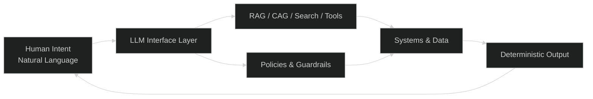

## TL;DR

> Every major computing shift has removed friction between humans and information.  
> The progression is clear:
>
> - **RDBMS:** We learned to *store* truth.
> - **Big Data:** We learned to *process* at scale.
> - **Cloud:** We learned to *access* infrastructure on demand.
> - **LLMs:** We’re learning to *interact* through natural language.
>  
> This isn’t hype. It’s the next architectural abstraction.

## Introduction

Every decade, someone declares the new thing a bubble. Databases were a bubble. Big Data was a bubble. Cloud was a bubble. Today that skepticism is directed at AI—specifically LLMs and conversational systems.

The irony is that each of these technologies went through the same cycle: early hype, enterprise hesitation, and then irreversible architectural adoption. AI is now following that same pattern, and the underlying reason is simple: each shift removed a layer of friction between humans and information.

Natural language interfaces are not hype. They are the next abstraction layer.

---

## The Pattern: Four Decades of Reducing Friction

### 1. RDBMS (1980s–1990s): We Learned to Store Truth  

Relational databases replaced bespoke file systems and hand-rolled indexing schemes. Query languages (SQL) let humans express intent rather than write traversal code.

A friction layer—storage—became an abstraction.

### 2. Big Data (2000s–2010s): We Learned to Process at Scale  

Data sets outgrew single-node limits. MapReduce, Spark, and distributed compute transformed “impossible” workloads into pipeline configurations.

A friction layer—scale—became an abstraction.

### 3. Cloud (2010s–2020s): We Learned to Democratize Access  

Procurement cycles, hardware refreshes, and capacity planning were barriers. APIs replaced servers. Infrastructure became programmable and globally available.

A friction layer—ownership—became an abstraction.

### 4. LLMs (2020s+): We Are Learning to Humanize Interaction  

LLMs collapse query languages, UI constraints, and rigid workflows into natural language.

A friction layer—interface—becomes an abstraction.

Each step removes a constraint that used to require specialists or custom code.  
Each step increases reach, lowers cost, and accelerates time to value.

---

## The Point: This Is Not a Bubble. This Is the Next Architecture

Bubbles are about inflated valuation. Architectural shifts are about reduction in implementation cost.

A 10×–100× drop in effort is not hype—it’s infrastructure.  
LLMs deliver a unified interface surface across systems, roles, and workflows. They don’t replace engineering; they multiply its reach.

Natural language is replacing niche query languages for the same reason SQL replaced COBOL file-handling routines:  
it compresses the cognitive load required to operate complex systems.

This is not a “new UX.”

It is the new integration layer.

---

## Risks

### 1. Misclassification as Hype  

Organizations may treat conversational computing as optional UI sugar rather than a foundational architecture.  
**Impact:** Loss of competitive advantage; prolonged reliance on brittle workflows.

### 2. Over-Reliance on Model Size  

Teams assume value scales with parameter count.  
**Impact:** Higher cost, degraded latency, and systems that fail under real-world constraints.

### 3. Lack of Guardrails  

AI systems deployed without deterministic constraints or structured orchestration.  
**Impact:** Hallucinations, compliance exposure, inconsistent output.

### 4. Fragmented Platform Strategy  

Mixing vendors, embedding models directly in apps, and skipping shared infrastructure patterns.  
**Impact:** Inability to scale reliably or govern enterprise-wide AI behavior.

---

## Mitigations

### 1. Treat LLMs as an Architectural Surface  

Build AI adapters, orchestration layers, policy enforcement, and RAG pipelines as first-class platform components.

### 2. Prefer Smaller, Well-Scoped Models  

Use model routing, cache augmentation, and retrieval over model size.  
Adopt SLM + RAG patterns over “bigly tuned” models for operational workloads.

### 3. Implement Deterministic Controls  

Define allowed tools, structured outputs, and constrained agent policies.  
Use verifiable pipelines, audit logs, and reproducible prompts.

### 4. Centralize Intelligence Engineering  

Unify model governance, RAG indexes, evaluation, testing, and observability under a shared internal practice.  
Cloud became a platform; conversational computing will too.

---

## Visual Model

---

## The Tell: Architecture Reduces Cost

AI skeptics today sound exactly like cloud skeptics in 2010:

- “It’s too expensive.”  
- “It isn’t secure enough.”  
- “Our workloads don’t need it.”  
- “It’s just hype.”

The companies that dismissed cloud are still running on-prem, fighting procurement timelines and hardware failures.

The companies that dismiss conversational computing will be managing brittle UIs, siloed data, and multi-year integration backlogs while their competitors move faster with fewer engineers.

---

## Close

AI is not a bubble.

AI is the next architectural leap.

If the last shift democratized infrastructure, this one democratizes interaction.  Enterprises that embrace it will rebuild their systems around language, intent, and orchestration—not interfaces.

Those who treat it as hype will be left maintaining legacy patterns while the rest of the industry moves on.

---

## References

- Stonebraker, Michael & Hellerstein, Joseph. *The End of an Architectural Era (It’s Time for a Complete Rewrite).* MIT / UC Berkeley.
- Dean, Jeffrey & Ghemawat, Sanjay. *MapReduce: Simplified Data Processing on Large Clusters.* Google Research.
- Hennessy, John & Patterson, David. *The Datacenter as a Computer: An Introduction to the Design of Warehouse-Scale Machines.* Morgan & Claypool.
- Stanford Human-Centered AI (HAI). *The Emerging Interface Layer of AI Systems.* Stanford University.
- Berkeley AI Research (BAIR). *The Foundation Model Reports.* University of California, Berkeley.
- Air Street Capital. *The State of AI Report.*
- NVIDIA Technical Blog. *LLM Deployment Economics, Inference Cost Modeling, and Scaling Tradeoffs.*
- Gartner Research. *The Rise of Intent-Based Interfaces and AI-Driven Interaction Models.*
- Anthropic. *System Card for Claude Models: Safety, Guardrails, and Evaluation Methodology.*

## Credits

### Image  

- Photo by <a href="https://unsplash.com/@clayleconey?utm_source=unsplash&utm_medium=referral&utm_content=creditCopyText">Clay LeConey</a> on <a href="https://unsplash.com/photos/low-angle-photography-of-high-rise-building-under-white-clouds-during-daytime-XSONkHbAHkU?utm_source=unsplash&utm_medium=referral&utm_content=creditCopyText">Unsplash</a>
