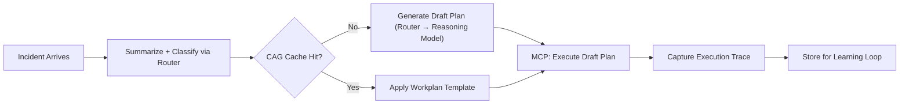
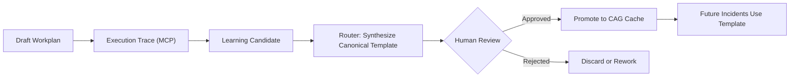
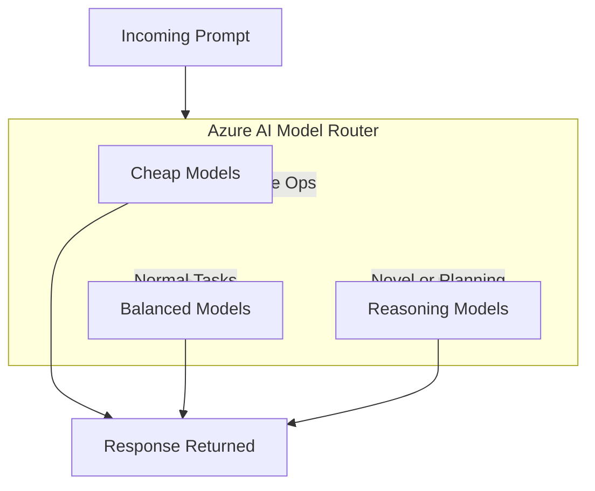
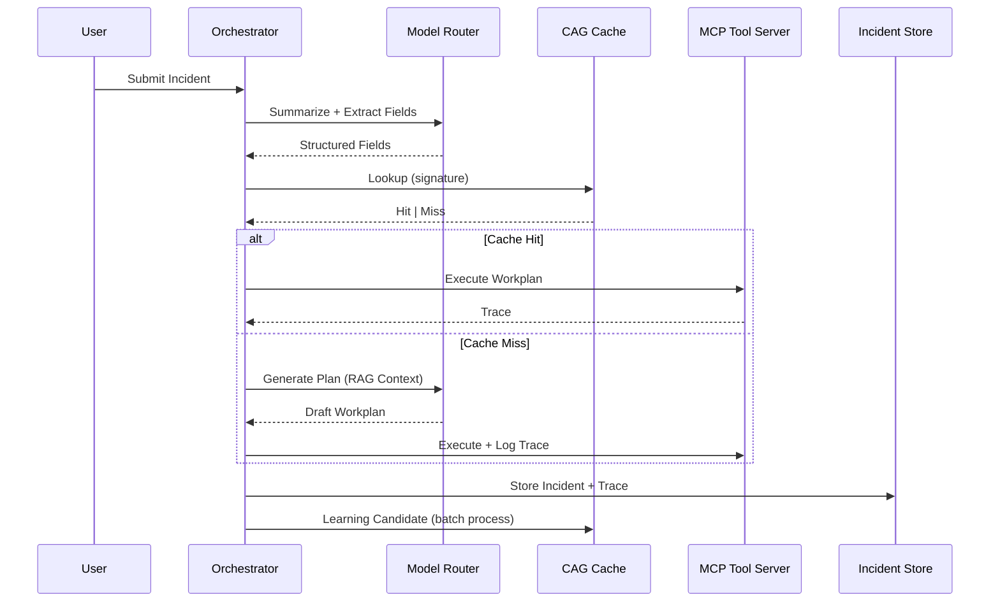

## TL;DR

TL;DR — Combine Cache‑Augmented Generation (CAG) with Azure Model Router to keep operational knowledge outside the model, route tasks cost‑effectively to the right model, and enable a governed self‑learning loop that improves ticket handling without retraining.

- CAG stores canonical workplans, required fields, and templates as external, versioned artifacts → deterministic, schema‑safe outputs.
- Model Router routes cheap models for routine work and stronger reasoning models for novel or complex planning → cost control + correctness.
- MCP executes templates and logs execution traces; traces become learning candidates that are synthesized, human‑reviewed, and promoted into the cache.
- Result: faster, auditable ITSM automation with no model drift, lower costs, and continuous improvement.

## Why CAG + Model Router Represents the Ideal ITSM Architecture

Modern IT Service Management needs an architecture that is fast, safe, repeatable, and continually improving. Traditional LLM-only approaches fall short: they hallucinate fields, embed volatile knowledge into weights, and are expensive to run and retrain.

Cache-Augmented Generation (CAG) changes this completely. CAG keeps operational knowledge — ticket patterns, workplans, required MCP fields — **outside** the model as structured artifacts. Azure AI’s Model Router enhances this by intelligently selecting lightweight or reasoning models depending on task complexity.

Together, they form a best-practice stack for ITSM automation.

With CAG:

- Workplans become deterministic templates  
- MCP tool calls become schema-safe  
- Knowledge updates require no model retraining  
- The system can learn from new incidents and enrich the cache

With Azure Model Router:

- Common tasks route to small/cheap models  
- Novel or complex tasks route to stronger reasoning models  
- A single endpoint manages model diversity and future upgrades  

CAG supplies the operational brain.  
Model Router supplies the reasoning engine.  
MCP supplies the hands.

This separation produces an architecture with long-term stability, cost control, and enterprise-grade auditability.

### High-Level Architecture Diagram

---

### How Self-Learning Emerges Without Fine-Tuning

Because CAG is externalized, the platform can evolve dynamically:

1. **Novel incidents** create draft workplans through the router (reasoning model chosen automatically).
2. **Execution traces** from MCP tools capture the real steps the system took.
3. A scheduled learner synthesizes canonical workplans and required fields.
4. A human reviews and promotes them into the cache.

No retraining. No drift. No expensive cycles.  
The knowledge layer becomes a governed, versioned asset — the way ITSM should be.

#### CAG Entry Lifecycle Diagram

## Why This Is the New Standard for Enterprise ITSM

CAG + Model Router is fully aligned with how Azure envisions enterprise AI:

- Explicit knowledge and rule layers  
- Model abstraction and cost-aware routing  
- Agentic execution through safe tool interfaces  
- Continuous improvement driven by structured data  

For ticket triage, diagnostics, escalation, incident templates, and automated remediation, nothing else offers this blend of **safety, speed, and maintainability**.

### How Model Router Fits Into the Flow

### Full ITSM Automation Pipeline

## References

### Further reading (references)

- [Don’t Do RAG: When Cache-Augmented Generation is All You Need for Knowledge Tasks](https://arxiv.org/html/2412.15605v1)
- [Optimizing LLMs with cache augmented generation](https://developer.ibm.com/articles/awb-llms-cache-augmented-generation/)
- [Retrieval‑Augmented Generation for Knowledge‑Intensive NLP — Lewis, Patrick et al., arXiv, 2020](https://arxiv.org/abs/2005.11401)  
- [REALM: Retrieval‑Augmented Language Model Pre‑Training — Guu, Kelvin et al., arXiv, 2020](https://arxiv.org/abs/2002.08909)  
- [Microsoft Semantic Kernel — GitHub (code + examples)](https://github.com/microsoft/semantic-kernel)  
- [Microsoft Semantic Kernel — docs and guidance on integrating external knowledge and tools](https://learn.microsoft.com/azure/ai-services/semantic-kernel/overview)  
- [Introducing the Model Context Protocol](https://www.anthropic.com/news/model-context-protocol)
- [Model Context Protocol (MCP) — specification and examples (GitHub)](https://github.com/microsoft/model-context-protocol)  
- [Azure AI / Model Router (routing and model‑selection guidance) — Microsoft Docs (Azure AI services overview and model routing)](https://learn.microsoft.com/azure/ai-services/)  

## Credits

### Quote

- BrainyQuote  
- …

### Image

- Unsplash  
- …
