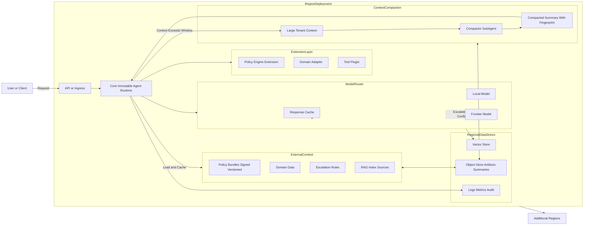

## Proximity Over Specialization

In my recent innovation projects, I’ve been designing, building, and validating agentic architectures, focusing on the reference architecture, the proof of concept, and the first working implementation. I’ve found it effective to use a consistent immutable runtime model across all agent types, including orchestrator, triage, responder, and extension agents, creating a common orchestration specification that scales and keeps behavior driven by external context with controlled extensibility.

There are no regional variants or tenant-specific branches, and no one-off forks created for compliance exceptions. The runtime is identical everywhere. The agent runs where the data lives, and all dynamic behavior comes from external artifacts and controlled extension points, not code changes. The design is intentional, preventing the fragmentation that runtime customization creates.

## Rationale for the Architecture

**Security needs consistency.**  
A single runtime means one SBOM, one digest, and a clear audit path. When asked what runs in a region, you provide the exact artifact identifier.

**Data residency must be automatic.**  
The same container deploys globally. Each agent instance pulls tenant context from its region and becomes compliant without custom builds.

**Upgrades must be predictable.**  
With only one runtime, global rollouts take minutes. Variation moves into versioned, verified data bundles and extensible modules, not the binary.

## Core Components of the Pattern

### Core Immutable Runtime with Modular Extensibility

The core runtime never changes per region or tenant. It provides a fixed execution path for stability, observability, and auditability. Flexibility comes from a modular extension layer that supports plugins, adapters, or capability modules. These extensions operate under strict boundaries and are versioned, signed, and controlled.

The core stays immutable for sanity and consistency.  
Extensions provide flexibility without compromising architecture integrity.  
Behavior remains data-driven, not code-fork driven.

### Externalized Context

Policies, product catalogs, escalation rules, and retrieval indexes exist as signed, versioned artifacts. The runtime pulls and caches them at startup. Replacing these artifacts updates behavior without changing the runtime itself.

### Deterministic Model Routing

Routing follows a predictable sequence:

- Cache first  
- Local 8B–70B model next  
- Frontier model only when required  

Every escalation is logged and reviewable.

### Automated Context Compaction

Enterprise tenants often provide massive policy or reference documents. The runtime triggers a compactor module using a long-context lightweight model. The compactor generates a deterministic low-temperature summary and returns a fingerprint. The agent continues execution with the compressed context.

Flow overview:

## Engineering Work That Made It Practical

- Compaction runs deterministically and is precomputed during policy deployment.  
- Every artifact, raw or summarized, carries a stable fingerprint for audit trails.  
- Compaction includes PII stripping; if too much content is removed, deployment halts.  
- Pre-loading compacted blobs reduces cold-start latency.  
- Local-model speculation reduces frontier model calls by more than half.  
- Extension modules are versioned artifacts, not ad-hoc code injections.

## Results After Long-Term Use

- Audits validated through a single runtime digest  
- Global patching consolidated into one predictable rollout  
- Frontier model usage reduced to exceptional cases only  
- No regional forks and no tenant-specific binaries  

## Closing

A single immutable runtime with externalized context and modular extensibility, deployed close to the data, is the pattern that consistently avoids the failure modes I experienced in other approaches.

## References

- [Architectural approaches for AI and ML in multitenant solutions](https://learn.microsoft.com/en-us/azure/architecture/guide/multitenant/approaches/ai-ml)
- [Multi-tenancy in AI Agentic Systems](https://isurusiri.medium.com/multi-tenancy-in-ai-agentic-systems-9c259c8694ac)
- [Workday Launches Workday EU Sovereign Cloud to Unlock Enterprise AI With Full EU Data Residency and Control](https://newsroom.workday.com/2025-11-19-Workday-Launches-Workday-EU-Sovereign-Cloud-to-Unlock-Enterprise-AI-With-Full-EU-Data-Residency-and-Control)
- [OpenAI Expands Data Residency for Enterprise Customers](https://www.techbuzz.ai/articles/openai-expands-data-residency-for-enterprise-customers)
- [Model router for Microsoft Foundry concepts](https://learn.microsoft.com/en-us/azure/ai-foundry/openai/concepts/model-router)
- [Tetrate Launches Agent Router Service to Streamline GenAI Cost Control and Model Reliability for Developers](https://tetrate.io/press/tetrate-launches-agent-router-service-to-streamline-genai-cost-control-and-model-reliability-for-developers)
- [Effective context engineering for AI agents – Anthropic](https://www.anthropic.com/engineering/effective-context-engineering-for-ai-agents)
- [Two Experiments We Need to Run on AI Agent Compaction – jxnl.co](https://jxnl.co/writing/2025/08/30/context-engineering-compaction)
- [Why AI Agent Startups Should Build Scalable Infrastructure From Day One](https://medium.com/@fendylike/why-ai-agent-startups-should-build-scalable-infrastructure-from-day-one-f3d4faf17d80)

## Credits

### Image

- Image generated with DALL·E (OpenAI); edited by Mark Roxberry
