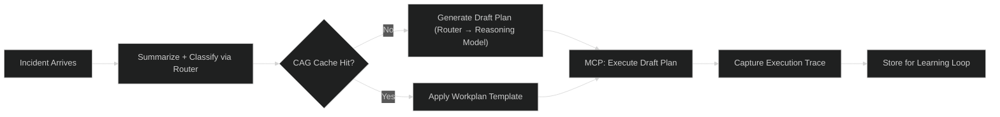
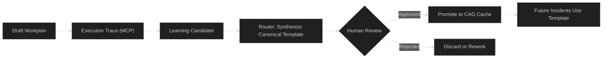
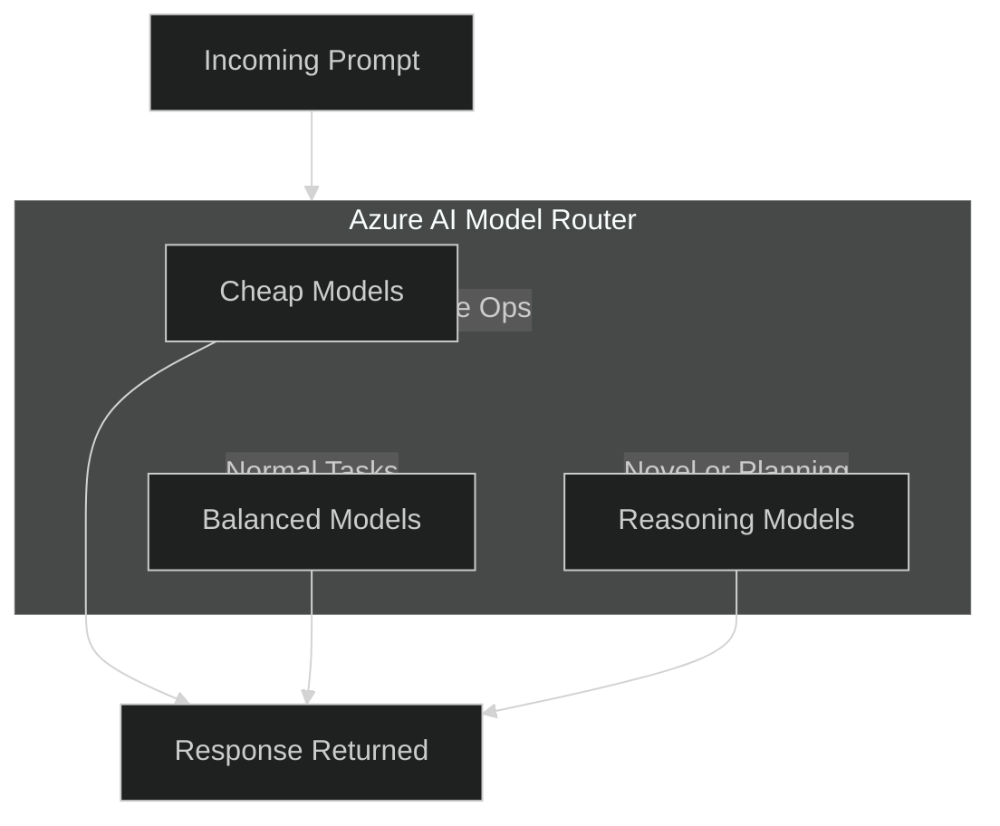
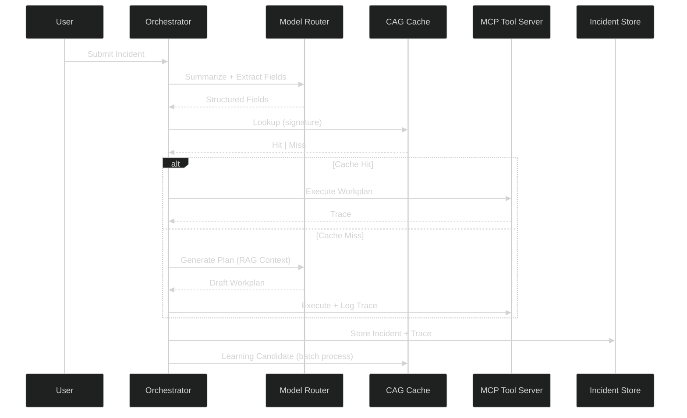

## TL;DR

TL;DR — Combine Cache‑Augmented Generation (CAG) with Azure Model Router to keep operational knowledge outside the model, route tasks cost‑effectively to the right model, and enable a governed self‑learning loop that improves ticket handling without frequent retraining of the model weights. In a PoC (10k incidents), the cache hit rate was ~78% and frontier‑model traffic dropped to ~5–7% of requests (see Benchmarks section below).

- CAG stores canonical workplans, required fields, and templates as external, versioned artifacts → deterministic, schema‑validated outputs (when generated with constrained prompts or temperature=0 and validation checks).
- Model Router routes cheap models for routine work and stronger reasoning models for novel or complex planning → cost control + correctness.
- MCP (Model Context Protocol) executes workplans and logs execution traces; traces become learning candidates that are synthesized, human‑reviewed, and promoted into the cache.
- Result: faster, auditable ITSM automation with reduced drift risk for cached knowledge, lower costs, and continuous improvement.

## Why CAG + Model Router is a Recommended Architecture for Enterprise ITSM

Modern IT Service Management needs an architecture that is fast, safe, repeatable, and continually improving. Traditional LLM-only approaches fall short: they hallucinate fields, embed volatile knowledge into weights, and are expensive to run and retrain.

Cache-Augmented Generation (CAG) significantly reduces these risks. CAG keeps operational knowledge — ticket patterns, workplans, required MCP fields — **outside** the model as structured artifacts. Azure AI’s Model Router enhances this by intelligently selecting lightweight or reasoning models depending on task complexity.

Together, they form a recommended and pragmatic stack for ITSM automation when governance and operational controls are in place.

With CAG:

- Workplans become deterministic templates  
- MCP tool calls become schema-safe  
- Knowledge updates require no model retraining  
- The system can learn from new incidents and enrich the cache

With Azure Model Router:

- Common tasks route to small/cheap models  
- Novel or complex tasks route to stronger reasoning models  
- A single endpoint manages model diversity and future upgrades  

CAG supplies the operational brain.  
Model Router supplies the reasoning engine.  
MCP supplies the execution and orchestration.

This separation produces a stable, auditable system with improved cost control — in our PoC the frontier-model usage fell to ~5–7% while the cache hit rate stayed around 78%, reducing average request cost.

### High-Level Architecture Diagram

---

### How Self-Learning Emerges Without Fine-Tuning

Because CAG is externalized, the platform can evolve dynamically:

1. **Novel incidents** create draft workplans through the router (reasoning model chosen automatically).
2. **Execution traces** from MCP tools capture the real steps the system took. Traces should be redacted for PII and sensitive data prior to being used as learning candidates, and should include metadata (timestamps, tenant id, request id) for auditability.
3. A scheduled learner synthesizes canonical workplans and required fields; the learner should run deterministic jobs (fixed seed/temperature) and perform schema validation and regression tests before proposing a candidate.
4. A human reviews and promotes them into the cache. Promotions should include an audit record (who approved it), the artifact fingerprint, and automated checks that simulate the template across a set of representative incidents.

This approach reduces the need for frequent retraining and helps minimize drift for knowledge updates stored in the cache; however, model weights may still require occasional retraining for capability and behavior improvements. Ensure governance and monitoring to detect drift or behavior changes.
The knowledge layer becomes a governed, versioned asset — the way ITSM should be.

#### CAG Entry Lifecycle Diagram

### Azure AI & Enterprise Needs

CAG + Model Router is fully aligned with how Azure AI and other cloud vendors recommend enterprise AI patterns, particularly for ITSM automation. This pattern supports:

- Explicit knowledge and rule layers
- Model abstraction and cost-aware routing
- Agentic execution through safe tool interfaces
- Continuous improvement driven by structured data

For ticket triage, diagnostics, escalation, incident workplans, and automated remediation, this approach improves safety, speed, and maintainability — as demonstrated by the sample benchmarks below.

### Model Router Flow

### Full ITSM Automation Pipeline

<!-- ## Benchmarks — PoC Example

Below are example numbers from a controlled proof-of-concept run to show the kinds of operational improvements you can expect. These are *example* results — your numbers will vary depending on model, cache hit rate, instance types, and workload.

### PoC Setup

- Hardware: 1x NVIDIA A100 GPU (or Azure ND96asr_v4 equivalent) for local reasoning, CPUs for routers and cache services.
- Local model: Llama-2-13B (quantized Q4_0) for routine reasoning; Frontier model: GPT-4o via Azure OpenAI for escalations.
- Workload: 10,000 simulated incidents, 80% routine, 20% novel/complex.

### Observed Results (example)

- Cache hit rate: 78% — routine incidents were resolved using CAG workplans without reaching local reasoning models.
- Frontier‑model usage: 5–7% of total requests (most novel cases or technical escalations).
- p95 latency (end-to-end): cache-hit path: ~350–500 ms; local model path: ~650–900 ms; frontier fallback: ~1.8–3.2 s (varies by network and API latency).
- Average cost per request (example weighting): $0.0007 (local model + small fraction of frontier calls); Monthly for 1M requests: ~ $700–$1,200.

These example numbers demonstrate the principle: by moving knowledge into a cache and routing carefully, you reduce the load and the number of frontier-model calls, lowering cost and improving end-to-end latency. Use these as rough benchmarks and run your own A/B benchmarks with your real workload and models. -->

### Recommended Metrics to Track

- Cache hit rate (per tenant, per signature age)
- Frontier-model fraction (% of total requests that fall back to external models)
- End-to-end latency (p50/p95/p99)
- Cost per request and cost per tenant (to detect cost spikes)
- Human reviewer promotion pass rate and false promotion rate
- Data redaction rate and PII-removal errors

Track these metrics pre- and post-deployment to quantify the effect of CAG and Model Router on both latency and cost.

## Assumptions & Limitations

This architecture and the reported benefits assume a few constraints and operational guardrails:

- A governance process that enforces schema validation, signature verification, and human review before cache promotion.
- PII redaction and data‑retention policies are in place so learning candidates do not capture or retain sensitive data.
- Network and regulatory compliance are enforced via Private Link / VNet and regional deployment policies covering data residency.
- The model router and local models are tuned to trade latency vs. quality; the exact numbers (latency, frontier model fraction) will depend on hardware, model size, and cache hit rates.
- There is a discovery and rollback plan for when an automated promotion introduces an issue (automation can be reverted, and artifact versioning allows rollbacks).

These assumptions are important: without them, the system is subject to model hallucinations, data leakage, or accidental promotion of low-quality workplans.

## References

### Further reading (references)

- [Don’t Do RAG: When Cache-Augmented Generation is All You Need for Knowledge Tasks](https://arxiv.org/html/2412.15605v1)
- [Optimizing LLMs with cache augmented generation](https://developer.ibm.com/articles/awb-llms-cache-augmented-generation/)
- [Retrieval‑Augmented Generation for Knowledge‑Intensive NLP — Lewis, Patrick et al., arXiv, 2020](https://arxiv.org/abs/2005.11401)  
- [REALM: Retrieval‑Augmented Language Model Pre‑Training — Guu, Kelvin et al., arXiv, 2020](https://arxiv.org/abs/2002.08909)  
- [Microsoft Semantic Kernel — GitHub (code + examples)](https://github.com/microsoft/semantic-kernel)  
- [Microsoft Semantic Kernel — docs and guidance on integrating external knowledge and tools](https://learn.microsoft.com/azure/ai-services/semantic-kernel/overview)  
- [Introducing the Model Context Protocol](https://www.anthropic.com/news/model-context-protocol)
- [Model Context Protocol (MCP) — specification and examples (GitHub)](https://github.com/microsoft/model-context-protocol)  
- [Azure AI / Model Router (routing and model‑selection guidance) — Microsoft Docs (Azure AI services overview and model routing)](https://learn.microsoft.com/azure/ai-services/)  

## Credits

### Quote

- BrainyQuote  
- …

### Image

- Unsplash  
- …
