## Introduction

Today we completed a significant architectural milestone: a **pluggable extension system** for the IAC (Intelligence Assurance Center) Prototype. Built on **Micro Frontend (MFE) architecture principles**, this system lets developers package and integrate specialized tools—testing, scanning, reporting, integrations—without touching the core codebase.

Each extension is self-contained (zip package with its own dependencies and entry point), integrity-verified via SHA256, schema-configurable, process-isolated on a dedicated port, and communicates with the host exclusively through well-defined APIs (`postMessage`, HTTP).

## Architecture: Host-Container-Micro-Application

The system has three components:

### 1. Registry (`extensions/registry.json`)

Central manifest of all available extensions:

```json
{
  "extensions": [
    {
      "manifest": {
        "id": "iac-prompt-injection-tests",
        "name": "Prompt Injection Tests",
        "version": "0.1.0",
        "type": "streamlit",
        "category": "testing",
        "permissions": ["network", "hostConfig", "reporting"],
        "settings": [ /* schema-driven config options */ ]
      },
      "zipFile": "iac-prompt-injection-tests-0.1.0.zip",
      "sha256": "a916dd6c...",
      "publishedAt": "2025-01-01T00:00:00Z"
    }
  ]
}
```

### 2. Frontend (React Host)

Serves as the MFE container: browses and manages extensions, renders dynamic settings forms from manifests, embeds extensions via iframe, and collects test results via `postMessage`.

### 3. Backend (Python Flask API)

Handles the extension lifecycle: downloads zips from the registry, verifies SHA256, extracts to `~/.iac/extensions/{extensionId}/`, injects `host_config.json`, and manages uninstallation.

## Extension Lifecycle

```mermaid
%%{init: {'theme':'dark'}}%%

sequenceDiagram
    participant Dev as Developer
    participant Reg as Registry
    participant User
    participant FE as Frontend
    participant BE as Backend
    participant FS as File System
    participant Ext as Extension
    
    rect rgb(40, 46, 49)
    Note over Dev: Development & Publishing Phase
    Dev->>Dev: Build Extension
    Dev->>Dev: Create manifest.json
    Dev->>Dev: Compute SHA256
    Dev->>Reg: Publish ZIP + metadata
    end
    
    rect rgb(40, 46, 49)
    Note over User,BE: Installation Phase
    User->>FE: Click Install
    FE->>BE: POST /api/extensions/install
    BE->>Reg: Download ZIP
    BE->>BE: Verify SHA256 hash
    BE->>FS: Extract to ~/.iac/extensions/
    BE->>FS: Generate host_config.json
    BE->>FE: Return install path
    FE->>FE: Update localStorage
    FE->>User: Display in sidebar
    end
    
    rect rgb(40, 46, 49)
    Note over User,Ext: Configuration & Execution Phase
    User->>FE: Configure settings
    FE->>FE: Save to localStorage
    User->>FE: Launch extension
    FE->>Ext: Create iframe + point to port
    Ext->>FS: Read host_config.json
    Ext->>Ext: Execute tests
    Ext->>FE: postMessage results
    FE->>FE: Store results
    FE->>User: Display in Results page
    end
    
    rect rgb(40, 46, 49)
    Note over User,BE: Uninstallation Phase
    User->>FE: Click Uninstall
    FE->>BE: DELETE /api/extensions/uninstall
    BE->>FS: Delete extension directory
    FE->>FE: Remove from localStorage
    FE->>User: Remove from sidebar
    end
```



## Key Features

### Security Through Hashing

SHA256 is pre-computed at publish time and verified at install, ensuring integrity and authenticity — users can trust what they're installing.

### Schema-Driven Configuration

Settings declared in the manifest:

```json
"settings": [
  {
    "key": "targetUrl",
    "label": "Target URL",
    "type": "string",
    "required": true,
    "default": "http://localhost:8000"
  },
  {
    "key": "timeout",
    "label": "Request Timeout (seconds)",
    "type": "number",
    "default": 30
  }
]
```

The host auto-generates forms, handles validation, and injects resolved values into `host_config.json`.

### Process-Level Isolation

Extensions run in separate processes on dedicated ports — stronger than JavaScript-level isolation. A broken extension cannot crash the host. Each has its own `requirements.txt` and Python environment.

### Extension Types

- **`streamlit`**: Embedded Streamlit apps for interactive UIs
- **`iframe`**: Generic embedded content from a URL
- **`api`**: Headless services (future)

### Results Collection

Testing extensions post structured results to the Assurance Results page: run metadata, pass/fail/skip summary, and per-test details with error traces.

## Example: Prompt Injection Testing Extension

The **iac-prompt-injection-tests** reference implementation is a Python Streamlit app that prepares and sends injection payloads, reports results back via `postMessage`, and surfaces them in the Results view with filtering and charts.

## Files and Directories

```text
iac-prototype/
├── extensions/
│   ├── registry.json                    # Central registry of extensions
│   ├── iac-prompt-injection-tests/      # Example testing extension
│   └── iac-prompt-injection-tests-0.1.0.zip
│
├── iac_extension_installer.py           # Backend installer logic
├── extension_api.py                     # Flask API server
│
├── iac-host/src/
│   ├── components/
│   │   ├── Extensions.tsx               # Extension browsing UI
│   │   ├── InstalledExtensions.tsx      # Installed extensions sidebar
│   │   └── ExtensionSettings.tsx        # Settings configuration UI
│   └── services/
│       └── ExtensionService.ts          # API client for extension endpoints
│
└── EXTENSION_INSTALLATION.md
```

## Deployment

### Development Mode

```bash
# Terminal 1: React host (localhost:3000)
cd iac-host && npm run dev

# Terminal 2: Flask API (localhost:5000)
python extension_api.py

# Terminal 3: Streamlit extension (localhost:8513)
cd extensions/iac-prompt-injection-tests && python app.py
```

### Production Mode

Host serves as static files; Flask API on the main domain or separate origin; registry can point to a CDN or S3 bucket.

## What's Next?

- **Extension Signing**: Cryptographic signatures for authenticity
- **Marketplace**: Web UI for browsing and installing from registry
- **Version Management**: Side-by-side multiple versions
- **Permissions Model**: Fine-grained access control
- **Hot Reload**: Update extensions without restarting
- **Custom Extension Types**: Extensions define their own integration patterns

## Conclusion

By combining a declarative registry, SHA256-verified deployment, schema-driven configuration, and process-level isolation, the IAC Prototype becomes a pluggable platform that scales through community contributions — each extension solving a specific problem without coupling to the host or its siblings.

---

*Originally published: March 2, 2026*  
*Project: OWASP HACTU8 - IAC Prototype*  
*Repository: [www-project-hactu8](https://github.com/OWASP/www-project-hactu8)*
