```mermaid
%%{init: {'theme':'dark'}}%%

sequenceDiagram
    participant Dev as Developer
    participant Reg as Registry
    participant User
    participant FE as Frontend
    participant BE as Backend
    participant FS as File System
    participant Ext as Extension
    
    rect rgb(40, 46, 49)
    Note over Dev: Development & Publishing Phase
    Dev->>Dev: Build Extension
    Dev->>Dev: Create manifest.json
    Dev->>Dev: Compute SHA256
    Dev->>Reg: Publish ZIP + metadata
    end
    
    rect rgb(40, 46, 49)
    Note over User,BE: Installation Phase
    User->>FE: Click Install
    FE->>BE: POST /api/extensions/install
    BE->>Reg: Download ZIP
    BE->>BE: Verify SHA256 hash
    BE->>FS: Extract to ~/.iac/extensions/
    BE->>FS: Generate host_config.json
    BE->>FE: Return install path
    FE->>FE: Update localStorage
    FE->>User: Display in sidebar
    end
    
    rect rgb(40, 46, 49)
    Note over User,Ext: Configuration & Execution Phase
    User->>FE: Configure settings
    FE->>FE: Save to localStorage
    User->>FE: Launch extension
    FE->>Ext: Create iframe + point to port
    Ext->>FS: Read host_config.json
    Ext->>Ext: Execute tests
    Ext->>FE: postMessage results
    FE->>FE: Store results
    FE->>User: Display in Results page
    end
    
    rect rgb(40, 46, 49)
    Note over User,BE: Uninstallation Phase
    User->>FE: Click Uninstall
    FE->>BE: DELETE /api/extensions/uninstall
    BE->>FS: Delete extension directory
    FE->>FE: Remove from localStorage
    FE->>User: Remove from sidebar
    end
```

## Introduction

Today we completed a significant architectural milestone: a **pluggable extension system** for the IAC (Infrastructure-as-Code) Prototype. This system allows developers to extend the platform with new testing, scanning, and reporting tools without modifying the core codebase.

The extension framework is built on **Micro Frontend (MFE) architecture principles**—a pattern that allows independent teams to develop, test, and deploy separate frontend features with minimal coordination. By applying MFE concepts, we've created a system where extensions function as autonomous micro applications that integrate seamlessly with the host platform.

In this post, we'll explore what we built, why it matters, how it works, and how MFE patterns enable this architecture.

## What is the IAC Extension System?

The extension system is a framework that enables third-party (or first-party) developers to package specialized tools and integrate them into the IAC host application. Drawing inspiration from **Micro Frontend architecture**, each extension is:

- **Self-contained**: A zip package with its own dependencies, configuration, and entry point (like an MFE bundle)
- **Secure**: Integrity-verified using SHA256 hashing (deployment verification)
- **Configurable**: Supports schema-driven settings that users can customize
- **Isolated**: Runs independently in its own process on a dedicated port (process-level isolation)
- **Discoverable**: Listed in a central registry with metadata and version info
- **Loosely coupled**: Communicates with the host only through well-defined APIs (`postMessage`, HTTP endpoints)
- **Independently deployable**: Can be installed, updated, or removed without affecting the host or other extensions

### Key Use Cases

1. **Testing Extensions**: Run compliance, security, or vulnerability tests (e.g., prompt injection testing)
2. **Scanning Extensions**: Perform code analysis, linting, or security scanning
3. **Reporting Extensions**: Generate custom reports and visualizations
4. **Integration Extensions**: Connect to external services or APIs

## Architecture Overview: A Microfrontend Approach

Drawing from proven MFE patterns, the system consists of three main components that form a **host-container-micro-application** architecture:

### 1. **Registry** (`extensions/registry.json`)

A centralized manifest of all available extensions, containing:

```json
{
  "extensions": [
    {
      "manifest": {
        "id": "iac-prompt-injection-tests",
        "name": "Prompt Injection Tests",
        "version": "0.1.0",
        "type": "streamlit",
        "category": "testing",
        "permissions": ["network", "hostConfig", "reporting"],
        "settings": [ /* schema-driven config options */ ]
      },
      "zipFile": "iac-prompt-injection-tests-0.1.0.zip",
      "sha256": "a916dd6c...",
      "publishedAt": "2025-01-01T00:00:00Z"
    }
  ]
}
```

### 2. **Frontend (React Host)** — The Container

The React application serves as the **MFE container**, providing:

- **Extensions Page**: Lists available extensions and installed extensions (discover & manage micro-apps)
- **Install/Uninstall UI**: One-click installation with progress feedback (deployment interface)
- **Settings UI**: Dynamic forms generated from extension manifests (declarative configuration)
- **Integration**: Embeds extensions in iframes or sidebars based on their type (micro-app rendering)
- **Results Service**: Collects results from testing extensions via `postMessage` API (inter-micro-app communication)
- **Routing & Navigation**: Directs users to the appropriate extension based on category (composite UI)

### 3. **Backend (Python Flask API)** — The Deployment Manager

A lightweight Flask server that functions as the **MFE deployment and lifecycle manager**:

- **Download**: Fetches extension zips from the registry URL (secure distribution)
- **Verification**: Validates SHA256 integrity (integrity checking before deployment)
- **Extraction**: Unpacks to `~/.iac/extensions/{extensionId}/` (isolated filesystem namespace)
- **Configuration**: Injects `host_config.json` with resolved settings (environment injection pattern)
- **Lifecycle Management**: Handles installation and uninstallation (micro-app lifecycle control)

## The Extension Lifecycle

Below is a visual representation of the complete lifecycle, from creation through uninstallation:



## How It Works: Step-by-Step

### Step 1: Extension Development and Publishing

Developers create an extension by:

1. Building their tool (Python Streamlit app, Node.js service, etc.)
2. Including a `manifest.json` that declares metadata, settings schema, and permissions
3. Packaging everything into a zip file
4. Computing the SHA256 hash of the zip
5. Adding an entry to `extensions/registry.json`

### Step 2: Installation

When a user clicks "Install" on an available extension:

1. **Frontend** sends: `POST /api/extensions/install` with extension metadata
2. **Backend** downloads the zip from the URL in the registry
3. **Backend** computes and verifies the SHA256 hash (security checkpoint)
4. **Backend** extracts the zip to `~/.iac/extensions/{extensionId}/`
5. **Backend** generates `host_config.json` with resolved settings
6. **Storage** updates localStorage with installed extension metadata
7. **UI** adds extension to sidebar under appropriate category

### Step 3: Configuration

Users can customize extension behavior through schema-driven settings:

- Settings are defined in the manifest as type, label, description, default, and required flag
- Settings UI is automatically generated by the host
- User selections are stored in localStorage and injected into `host_config.json`
- Extensions read their settings from `host_config.json` at runtime

### Step 4: Execution and Results

For testing extensions:

1. **Host** creates an iframe pointing to the extension's assigned port
2. **Extension** starts and reads `host_config.json` for configuration
3. **Extension** executes tests and collects results
4. **Extension** posts results back to host using: `window.parent.postMessage({ type: 'iac-extension-results', payload })`
5. **Host** stores results in localStorage via `resultsService`
6. **Results Page** displays test runs, pass rates, and detailed results

### Step 5: Uninstallation

When a user uninstalls:

1. **Frontend** sends: `DELETE /api/extensions/uninstall`
2. **Backend** deletes the extension directory from `~/.iac/extensions/{extensionId}/`
3. **Storage** removes metadata from localStorage
4. **UI** removes extension from sidebar and all references

## Micro Frontend Design Patterns in Play

Our extension system leverages several proven MFE patterns:

### 1. **Registry-Based Discovery**

Like module federation in webpack, extensions are discovered through a central registry rather than being compiled together. This enables:

- Independent publication and versioning
- Dynamic loading at runtime
- Decoupled release cycles

### 2. **Process-Level Isolation**

Instead of JavaScript-level isolation (as in some MFE implementations), extensions run on separate ports. This provides:

- True resource isolation (memory, CPU, file system)
- Crash isolation (a broken extension doesn't crash the host)
- Independent scaling and restart capabilities

### 3. **Standardized Communication**

Extensions and the host communicate through:

- **HTTP APIs** for control operations (install, uninstall, configure)
- **postMessage API** for inter-process results and events
- This mirrors how micro frontends communicate in browser-based MFE systems

### 4. **Declarative Manifests**

Each extension declares its capabilities, settings, and permissions via `manifest.json`, similar to:

- Module Federation `shared` configuration
- Service worker manifests
- Browser extension manifests

## Key Features and Benefits

### Security Through Hashing

Every extension is verified using SHA256 hashing. The hash is pre-computed during publishing and verified at install time, ensuring:

- **Integrity**: No modifications during transport
- **Authenticity**: Registry publisher controls distribution
- **Safety**: Users can trust what they're installing

### Schema-Driven Configuration

Settings are defined declaratively in the manifest:

```json
"settings": [
  {
    "key": "targetUrl",
    "label": "Target URL",
    "type": "string",
    "required": true,
    "default": "http://localhost:8000"
  },
  {
    "key": "timeout",
    "label": "Request Timeout (seconds)",
    "type": "number",
    "default": 30
  }
]
```

The host automatically generates UI forms, handles validation, and injects resolved values.

### MFE-Style Isolation and Independence

Each extension embodies core MFE principles:

- **Process Isolation**: Runs in its own process on a dedicated port (stronger than JavaScript-level isolation)
- **Dependency Independence**: Has its own `requirements.txt` and Python environment (no shared dependency hell)
- **Independent Lifecycle**: Can be installed, updated, or removed without affecting the host or sibling extensions
- **Bounded Communication**: Can't directly access host internals; communication is strictly through well-defined APIs
- **Loose Coupling**: The host knows nothing about extension internals, only how to invoke them and receive results

### Multiple Extension Types

The system supports different extension types for different use cases:

- **`streamlit`**: Embedded Streamlit apps (good for interactive UIs)
- **`iframe`**: Generic embedded content from a URL
- **`api`**: Headless services (future support)

### Results Collection

Testing extensions can report structured results that appear in the Assurance Results page:

- **Run metadata**: Extension ID, name, target, timestamp
- **Summary**: Total passed, failed, skipped, and duration
- **Details**: Per-test results with status and error traces

## Example: Prompt Injection Testing Extension

The **iac-prompt-injection-tests** extension is the reference implementation:

1. **Development**: Python Streamlit app that prepares and sends injection payloads
2. **Manifest**: Declares that it needs network access, host config, and can report results
3. **Settings**: Allows users to configure target URL, timeout, and verbosity
4. **Execution**: Runs tests and posts results back to the host
5. **Results**: Test results appear in the Assurance Results view with filtering and charts

## Files and Directories

```text
iac-prototype/
├── extensions/
│   ├── registry.json                    # Central registry of extensions
│   ├── iac-prompt-injection-tests/      # Example testing extension
│   └── iac-prompt-injection-tests-0.1.0.zip  # Published zip
│
├── iac_extension_installer.py           # Backend installer logic
├── extension_api.py                     # Flask API server
│
├── iac-host/src/
│   ├── components/
│   │   ├── Extensions.tsx               # Extension browsing UI
│   │   ├── InstalledExtensions.tsx      # Installed extensions sidebar
│   │   └── ExtensionSettings.tsx        # Settings configuration UI
│   └── services/
│       └── ExtensionService.ts          # API client for extension endpoints
│
└── EXTENSION_INSTALLATION.md            # User installation guide
```

## Deployment

### Development Mode

```bash
# Terminal 1: Start the host (React at localhost:3000)
cd iac-host
npm run dev

# Terminal 2: Start the backend API (Flask at localhost:5000)
python extension_api.py

# Terminal 3: Start an extension (Streamlit at localhost:8513)
cd extensions/iac-prompt-injection-tests
python app.py
```

### Production Mode

- Host is built and served as static files
- Backend API runs on the main domain or separate origin
- Extensions are installed to `~/.iac/extensions/`
- Registry can point to a CDN or S3 bucket for distribution

## What's Next?

Future enhancements could include:

- **Extension Signing**: Cryptographic signatures for authenticity
- **Marketplace**: Web UI for browsing and installing from registry
- **Version Management**: Side-by-side multiple versions of an extension
- **Permissions Model**: Fine-grained access control for extension capabilities
- **Hot Reload**: Update extensions without restarting
- **Extension Debugging**: Built-in tools for developing and testing extensions
- **Custom Extension Types**: Allow extensions to define their own integration patterns

## Conclusion: MFE Principles Enable Platform Scalability

The extension system transforms the IAC Prototype from a monolithic application into a **pluggable platform** by applying proven Micro Frontend architecture patterns. By combining:

- A declarative registry (discovery without coupling)
- Secure hash verification (verified deployment)
- Schema-driven configuration (environment injection)
- Process-level isolation (true independence)
- Standardized result collection (normalized communication)

...we've created a foundation that enables:

- **Community contributions** without coordination overhead
- **Custom integrations** with minimal host changes
- **Rapid iteration** on testing and scanning capabilities
- **Team autonomy** — different teams can build extensions independently
- **Safe experimentation** — broken extensions don't break the platform

The MFE approach scales the IAC Prototype from a single monolithic application to a thriving ecosystem of specialized micro-applications, each solving a specific problem while remaining part of a cohesive whole.

Get started by exploring [EXTENSIONS_GUIDE.md](./EXTENSIONS_GUIDE.md) to see how to build your own extension, or [EXTENSION_INSTALLATION.md](./EXTENSION_INSTALLATION.md) for user installation instructions.

---

*Originally published: March 2, 2026*  
*Project: OWASP HACTU8 - IAC Prototype*  
*Repository: [www-project-hactu8](https://github.com/OWASP/www-project-hactu8)*

### Image

Photo by <a href="https://unsplash.com/@zonduurzaam?utm_source=unsplash&utm_medium=referral&utm_content=creditCopyText">Zonduurzaam Deventer</a> on <a href="https://unsplash.com/photos/a-close-up-of-a-red-light-on-a-white-device-BFNi3TWB2fw?utm_source=unsplash&utm_medium=referral&utm_content=creditCopyText">Unsplash</a>
