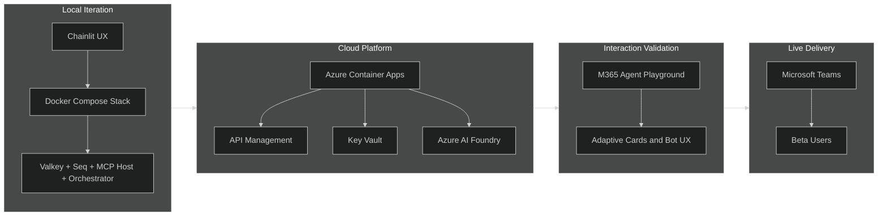
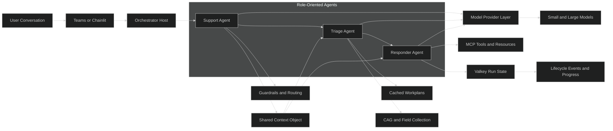
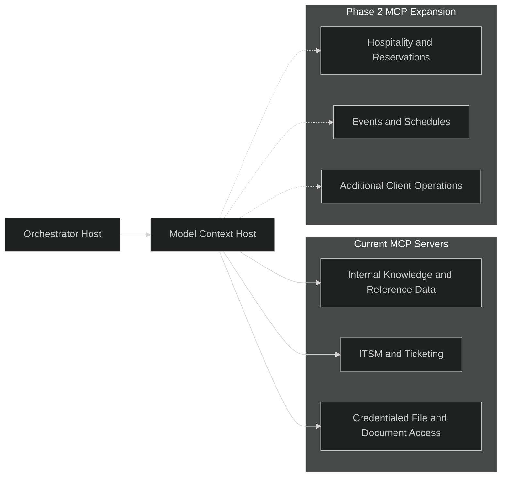
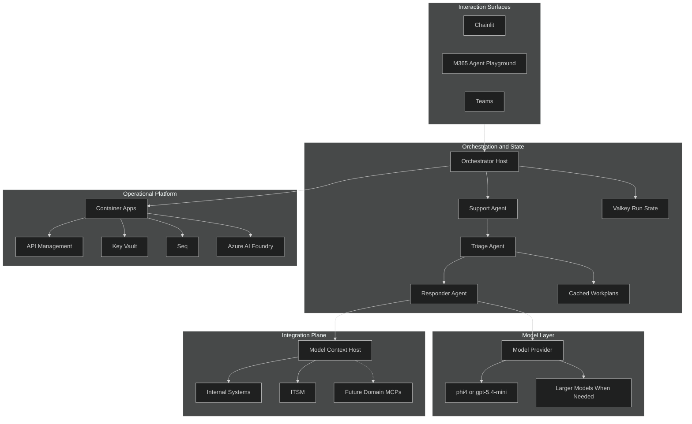
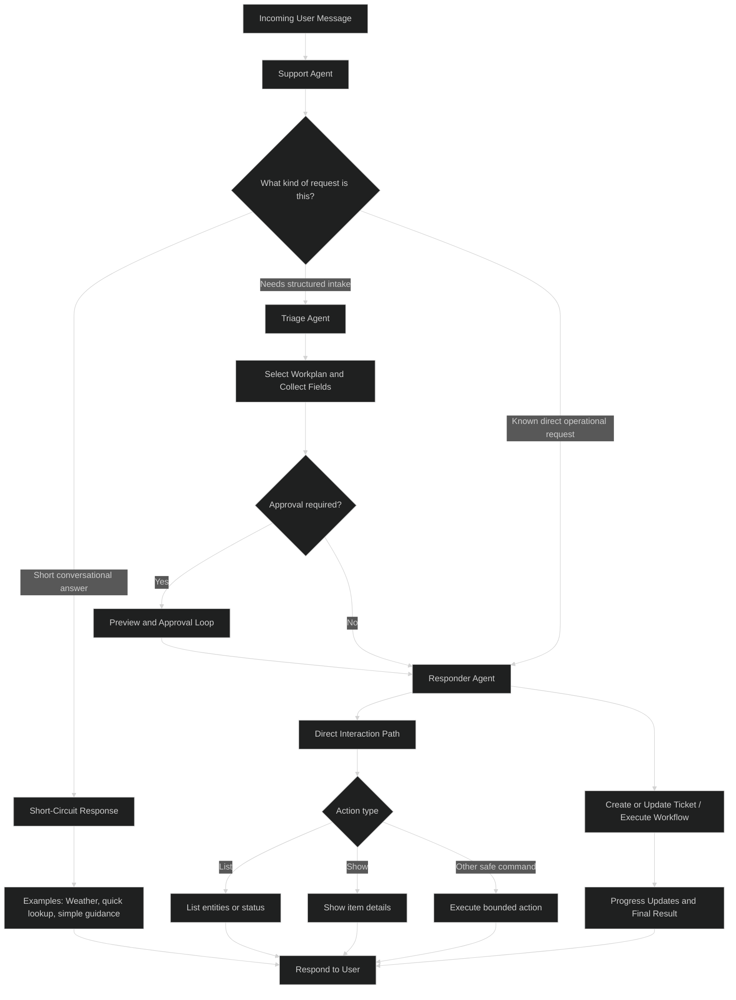

## Why an Operational Agent Architecture?

There is no shortage of impressive agent demos. There is a shortage of agent systems that can survive real operational work.

The gap is usually not raw model capability. The gap is everything around the model: user experience, state management, execution control, tool integration, observability, and cost discipline. A system that can answer a question is not automatically a system that can carry out accountable work.

That distinction shaped this architecture. The goal was not to build a chatbot with tools attached. The goal was to build a governed orchestration platform that could support conversational workflows, structured execution, external system integration, and live operational use.

## Start with Practical UX

One of the strongest lessons in this project was that practical UX matters as much as reasoning quality.

The platform moved through four distinct surfaces, each serving a different phase of the build.

Chainlit came first. Using Docker Compose, the full orchestration stack (Valkey, Seq for structured logging, the model context host, the orchestrator host, and Chainlit as the UX layer) could be stood up and iterated against locally. That environment made it practical to validate orchestration behavior, MCP integration, and run state without any cloud dependency in the way.

Once the core stack was stable, the platform was provisioned to Azure: Container Apps for the services, APIM to front the orchestrator host with a subscription key, Key Vault for credential management, and Azure AI Foundry with a project to host the model deployments used by the LLM client and model provider layer.

With the cloud stack in place, the Microsoft 365 Agent Playground became the right surface for the next phase. Because it shared the same bot app service as the eventual Teams deployment, it was practical for modeling adaptive cards, testing user interaction patterns, and catching short-circuit behaviors without needing to manage the full Teams provisioning overhead.

Microsoft Teams was the final delivery surface. The Teams bot is the user-facing entry point. Conversations start there, and messages are forwarded to the orchestrator host via a /chat call where the agent pipeline takes over. With custom upload support and Azure access configured, the beta stack was provisioned for the Teams app and bot service. The platform is currently in MVP state with beta testers actively using it at the client.

This mattered because real workflows are not single-turn prompts. Users need draft previews, cancel and approval steps, field collection, progress visibility, and recovery paths when they change direction mid-conversation. Those interaction details are not polish. They are part of the control plane.

### UX Patterns That Proved Valuable

- Conversational field collection instead of static forms
- Preview and approval before execution
- Clear draft editing flows when users revise intent
- Progress updates during background execution
- Consistent behavior across Teams and Chainlit

The progression of delivery surfaces looked roughly like this.

## Orchestration Is the Product

The most important design choice was treating orchestration as the core product rather than treating the model as the product.

Instead of one general-purpose agent, the system used role-oriented agents with clearer responsibilities.

- A support agent handled early guardrail and routing checks. It could use the model provider when classification or policy evaluation was needed, then decide whether the request should short-circuit, move into structured intake, or proceed directly to execution.
- A triage agent handled requests that needed a workplan. It used Cached Augmented Generation to select and apply the right cached workplan: structured operational intent that defined what fields to collect, what MCP tools to invoke, what policies applied, and what verbiage to use. Triage drove the conversational field collection and prepared the request for execution.
- A responder agent executed approved work through deterministic steps, MCP tool calls, and retry or escalation paths. It could also use the model provider where generation or reasoning was useful, but its center of gravity was bounded execution against tools and run state.

This was not a design where only one agent touched LLMs. All three agents could use the model provider layer. The separation was about operational responsibility: support optimized for guardrails and routing, triage optimized for CAG-backed intake and workplan handling, and responder optimized for tool-backed execution.

The support agent also produced a context object passed forward to subsequent agents. Rather than re-deriving context at each stage, agents downstream could rely on a structured, shared representation of the interaction, making handoffs cleaner and leaving room for the context to carry additional state as the platform grows.

That separation made the system easier to reason about. It also made it easier to balance flexibility with control. Not every part of the workflow benefits from open-ended reasoning. Some stages need structured inference, and some stages need deterministic execution.

### Why This Split Helped

- It reduced ambiguity in execution paths.
- It made approval boundaries explicit.
- It created cleaner handoffs between conversation and action.
- It allowed the system to fail more gracefully when external dependencies were slow or incomplete.

At a high level, the orchestration tier looked like this.

## Stateful Runs Turn Conversation into Execution

One of the recurring problems in agent systems is confusing prompt history with runtime state. Those are not the same thing.

This platform used Valkey-backed run state to maintain continuity across conversations, preserve draft progress, and support multi-step execution. Instead of relying only on a growing transcript, the system treated each operational task as a run with explicit state, events, and lifecycle transitions.

That made several things possible:

- maintaining conversation context across turns,
- persisting draft state before approval,
- resuming long-running or interrupted workflows,
- tracking execution progress independently from the chat surface,
- and keeping orchestration logic grounded in durable state rather than inference alone.

This was one of the clearest differences between a conversational demo and an operational platform. Durable state is what turns a chat exchange into a governable execution model.

## A Model Context Host as an Integration Platform

Rather than hard-coding external APIs and internal resources into agent logic, an innovation I introduced is a "model context host" - a platform layer that clients use to register and expose their own MCP servers: internal tools, external APIs, credentialed back-end systems, and domain-specific capabilities.

The orchestration layer discovers and invokes tools, prompts, and resources through this host without needing direct knowledge of the underlying systems. Clients own and manage what they expose. The agent layer consumes a stable interface.

That separation mattered for several reasons: credentials and implementation details stay isolated, capabilities can be versioned and updated independently, and the same host can serve multiple agent workflows across different domains without requiring changes to orchestration logic.

This is where the architecture started to feel less like a single application and more like a reusable platform primitive. The same host that served operational support workflows can equally serve internal reference data e.g. locations, events, schedules, or any domain-specific knowledge a client wants to make available to the agent layer without rebuilding the orchestration stack around it.

The model context host was intended to grow as a client-owned integration plane.

## Workplans, Cached Augmented Generation, and Smaller Models

A major design goal was avoiding the assumption that every step requires a large model call.

The architecture used workplans as the primary mechanism for structured operational intent. A workplan for a given request type defined the fields to collect, the MCP tools to invoke, the policies that applied, and the verbiage to use in conversation. This is Cached Augmented Generation, not Retrieval Augmented Generation. Rather than dynamically retrieving documents at runtime and asking the model to reason over them, the augmentation was pre-structured and cached: the triage agent consumed a known workplan and drove a deterministic intake flow from it. The model's role was narrower and more reliable as a result.

I reiterated that there is a meaningful distinction in the early design stage.  RAG is appropriate when the answer is unknown and must be found. CAG is appropriate when the structure of the interaction is known and should be enforced. For operational workflows with defined intake requirements, CAG produced more consistent behavior (no hallucinations), lower latency, and better cost characteristics than open-ended retrieval.

This approach improves several things at once.

- Lower latency for common flows
- Better determinism for known operational patterns
- Lower cost through reduced dependence on larger models
- Cleaner separation between retrieval, routing, and execution

That combination is more interesting than simply saying the system supports multiple models. The real value comes from structuring the problem so that smaller and cheaper models can succeed more often.

## Model Provider Abstraction and FinOps

Model choice was treated as an architectural concern, not just a configuration detail.

The platform introduced a model provider layer so deployments could externalize model selection and evolve without rewriting orchestration logic. That matters for technical flexibility, but it also matters for financial control.

Once a system performs repeated classification, extraction, routing, and execution assistance at scale, cost becomes part of correctness. If a workflow can be handled by a smaller model or a cached workplan path, then using a more expensive model by default is not sophistication. It is waste.

This is where FinOps enters the architecture. Cost-aware model routing, provider abstraction, and telemetry are not side concerns. They are part of making agentic systems sustainable. Full cost governance, including per-workflow spend tracking, model routing telemetry, and budget-aware routing decisions, is an active area of development and a priority for the next phase of the platform.

## What Felt Novel in Practice

Several parts of this architecture felt meaningfully different from a typical chatbot stack.

- Four progressive delivery surfaces: local Docker stack, Azure provisioning, M365 Agent Playground, and Teams MVP
- Support, triage, and responder agents with a shared context object passed across handoffs
- Valkey-backed runs as a first-class execution concept
- A model context host as a client-configurable integration platform for MCP servers
- Workplan-driven execution using Cached Augmented Generation (CAG) rather than RAG for known operational patterns
- Deliberate use of smaller models such as phi4 or gpt-5.4-mini where the task did not justify a larger model
- Cost awareness designed into the orchestration layer rather than deferred to operations later

None of these choices alone is revolutionary, but I think together they create a more disciplined approach to building agent systems that have to operate in live environments.

### Why LLMs and MCP Mattered, Despite Existing Non-LLM Solutions

It is reasonable to ask whether this architecture was achievable without LLMs or MCP. In one sense, yes. We already have non-LLM solutions for workflow orchestration, approval chains, state machines, rules engines, integration middleware, and form-driven operational intake. Those systems are real, useful, and in many domains still the right answer.

But that observation does not refute the architectural choices here. It changes the comparison. The relevant question is not whether a similar system could have existed before. The relevant question is whether the same level of conversational flexibility, reusable integration, and operational readiness could have been delivered to live beta use in roughly three months without a much larger amount of bespoke logic.

My view is no.

Without LLMs, the platform could still have been built, but the interaction layer would have required more rigid forms, narrower branching logic, more handcrafted intent classification, and less graceful recovery when users changed direction mid-conversation. Without MCP, the platform could still have exposed tools and back-end systems, but through a more custom integration model with tighter coupling between orchestration logic and client capabilities.

So the argument is not that LLMs and MCP made the platform theoretically possible. The argument is that they materially improved the implementation curve. LLMs reduced the amount of deterministic intake logic that had to be authored up front. MCP reduced the amount of custom plumbing required to expose reusable tools, prompts, and resources behind a stable interface. That combination made it practical to reach governed, operationally useful software faster, without collapsing into a brittle demo.

## From Architecture to Live Use

The most useful validation was not internal elegance. It was getting the system into a live operational surface.

Moving from a local Docker stack through Azure provisioning and into an active beta deployment changed the quality of feedback at each step. Real user interaction exposed the importance of interruption handling, state continuity, messaging tone, approval loops, and back-end reliability in ways that local iteration could only partially surface.

That transition reinforced a simple point: the closer agent systems get to real users, the more architecture decisions around UX, state, and governance matter.

## Conceptual Layout

Taken together, the platform can be viewed as a set of cooperating tiers.

## Generalized Interaction Flows

At runtime, the interaction patterns generally fall into a small number of paths.

## Lessons Learned

The biggest lesson is that an agent platform is mostly about disciplined system design.

Good conversational UX reduces orchestration friction. Durable run state reduces confusion. Workplans reduce unnecessary reasoning. Tool abstraction reduces coupling. Smaller models become more viable when the surrounding system is structured well. And cost control becomes easier when the architecture makes efficient paths the default.

The result is not less intelligence, but better use of intelligence.

## References

- [Model Context Protocol](https://modelcontextprotocol.io/)
- [Chainlit](https://www.chainlit.io/)
- [Docker Compose](https://docs.docker.com/compose/)
- [Microsoft Adaptive Cards](https://adaptivecards.microsoft.com/)
- [Microsoft 365 Agent Playground](https://learn.microsoft.com/en-us/microsoft-365/agents/agents-sdk/debug-with-agent-playground)
- [Microsoft Teams Development](https://learn.microsoft.com/microsoftteams/platform/)
- [Azure API Management](https://learn.microsoft.com/en-us/azure/api-management/)
- [Azure Container Apps](https://learn.microsoft.com/en-us/azure/container-apps/)
- [Azure Key Vault](https://learn.microsoft.com/en-us/azure/key-vault/)
- [Azure AI Foundry](https://learn.microsoft.com/en-us/azure/ai-foundry/)
- [Microsoft Phi-4](https://azure.microsoft.com/en-us/products/phi/)
- [OpenAI gpt-5.4-mini](https://openai.com/index/introducing-gpt-5-4-mini-and-nano/)
- [Valkey](https://valkey.io/)
- [Seq](https://datalust.co/seq)
- [FinOps Framework](https://www.finops.org/framework/)
- [Microsoft Azure AI Foundry Model Router](https://learn.microsoft.com/en-us/azure/foundry/openai/concepts/model-router)
- [Don't Do RAG: When Cache-Augmented Generation is All You Need for Knowledge Tasks](https://arxiv.org/abs/2412.15605)
